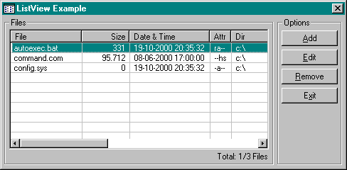



## ListView Example

### Description

This is a easy example how to use a listview box with 5 headers and a static label for beginners. In this example you can Add / Edit / Remove files to the listview box in runtime. Now Includes Sort-Headers by clicking on the header. I've worked on this code because users asked me hundered times how they can add items to the listview with multi headers. So I've coded this for them. Now I share this code on planet-source-code. Please VOTE my code, because it's special coded for you. I'm sure you like this code... Use it for free without credit me, just VOTE this code now!!
 
### More Info
 

             |
---                |---
**Submitted On**   |2000-12-05 01:19:56
**By**             |[MAGiC MANiAC^mTo](https://github.com/Planet-Source-Code/PSCIndex/blob/master/ByAuthor/magic-maniac-mto.md)
**Level**          |Beginner
**User Rating**    |4.5 (72 globes from 16 users)
**Compatibility**  |VB 6\.0
**Category**       |[Coding Standards](https://github.com/Planet-Source-Code/PSCIndex/blob/master/ByCategory/coding-standards__1-43.md)
**World**          |[Visual Basic](https://github.com/Planet-Source-Code/PSCIndex/blob/master/ByWorld/visual-basic.md)
**Archive File**   |[CODE\_UPLOAD123411242000\.zip](https://github.com/Planet-Source-Code/magic-maniac-mto-listview-example__1-13309/archive/master.zip)

